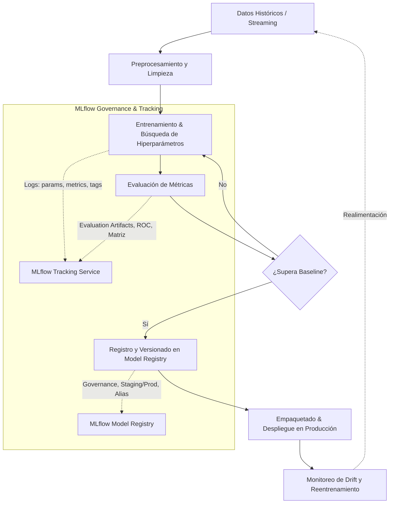
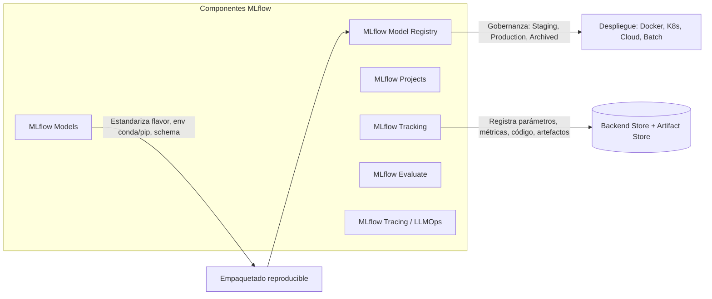

# Investigación Técnica y Teórica: MLflow en el Ecosistema MLOps

**Asignatura:** Ciencia de Datos  
**Institución:** Universidad de Cuenca  
**Integrantes:** Xavier Peña & Joseph Salamea  
**Categoría:** MLOps y seguimiento de experimentos (despliegue y gobernanza)  
**Herramienta Principal:** MLflow (Open Source, v2.x)  
**Herramienta Alternativa / Comparativa:** Weights & Biases (W&B)  
**Fecha:** Octubre 2026  

---

## 1. Introducción y Planteamiento del Problema

El desarrollo de sistemas de Aprendizaje Automático (Machine Learning - ML) difiere radicalmente del desarrollo de software tradicional. Mientras que el ciclo de vida del software tradicional gestiona principalmente código fuente estático (`código -> compilación -> despliegue`), un sistema de ML introduce una tridimensionalidad compuesta por:
1. **Código:** Algoritmos, preprocesamiento y tuberías de transformación.
2. **Datos:** Distribución estadística, esquemas, sesgos y particiones temporales.
3. **Hiperparámetros y Modelos:** Pesos ajustados, configuraciones del optimizador y artefactos binarios generados.

Tal como señalaron Sculley et al. (2015) en su influyente artículo sobre la *deuda técnica oculta en sistemas de ML*, el código propio del modelo de ML representa solo una pequeña fracción del ecosistema total. La mayor parte de los costos y fallas en producción radican en la configuración, recolección de datos, verificación, gestión de características, gobernanza y monitoreo de la infraestructura.

En este contexto surge **MLOps (Machine Learning Operations)**, definido por Kreuzberger et al. (2023) como el conjunto de prácticas y herramientas estandarizadas orientadas a unificar el desarrollo (Dev) y la operación (Ops) de sistemas de ML, garantizando reproducibilidad, trazabilidad, escalabilidad y automatización continua.

---

## 2. Presentación de la Herramienta: MLflow

### 2.1. ¿Qué es MLflow y qué problema resuelve?
**MLflow** es una plataforma de código abierto (*open-source*) de extremo a extremo diseñada para gestionar el ciclo de vida completo del aprendizaje automático. Fue concebida para resolver tres problemas críticos en la ciencia de datos:
1. **Falta de Trazabilidad y Reproducibilidad:** Sin una plataforma centralizada, los científicos de datos suelen guardar métricas en hojas de cálculo, cuadernos locales desordenados o nombres de archivos arbitrarios (ej. `modelo_final_v2_definitivo.pkl`), lo que hace imposible reproducir resultados semanas después.
2. **Dificultad de Empaquetado y Reutilización:** Los modelos dependen de versiones específicas de librerías (Python, scikit-learn, XGBoost, PyTorch). Compartir un modelo con ingenieros de software o ponerlo en producción a menudo falla por discrepancias de entorno.
3. **Ausencia de Gobernanza y Despliegue Estandarizado:** Falta de un registro formal que determine qué modelo está en desarrollo (*staging*), cuál está en producción (*production*) y qué datos/código exacto lo generaron.

### 2.2. Desarrollador, Historia y Gobernanza
* **Creador Original:** Databricks (liderado por Matei Zaharia, creador de Apache Spark, Andrew Chen, Aaron Davidson, entre otros) en 2018.
* **Gobernanza Actual:** En 2020, Databricks donó el proyecto a la **Linux Foundation**, consolidándolo como un proyecto comunitario abierto, neutral e interoperable con cualquier nube o proveedor de infraestructura.
* **Licencia:** **Apache License 2.0** (código abierto permisivo, permite uso comercial, modificación y distribución sin costo de licencia).
* **Costo:** 100% gratuito en su versión comunitaria auto-alojada (*self-hosted*). Existe una versión administrada dentro de Databricks Cloud (*Managed MLflow*) que cobra por cómputo de la plataforma, pero la versión local y de servidor independiente no tiene costos de licencia.

---

## 3. Arquitectura y Componentes Clave de MLflow

MLflow está diseñado bajo una arquitectura modular y agnóstica de librerías (*library-agnostic*), lo que significa que funciona transparentemente con Scikit-learn, PyTorch, TensorFlow, XGBoost, LightGBM, Hugging Face Transformers o código Python puro.

### 3.1. MLflow Tracking
Es el componente central para el registro estructurado de ejecuciones de experimentos. Permite registrar mediante API:
* **Parámetros:** Entradas de configuración clave-valor (ej. `learning_rate=0.01`, `n_estimators=100`, `max_depth=5`).
* **Métricas:** Valores numéricos escalares evaluados a lo largo del tiempo o al final del entrenamiento (ej. `accuracy`, `f1_score`, `rmse`, `r2_score`, tiempo de entrenamiento). MLflow permite graficar curvas de aprendizaje a lo largo de pasos (*steps*) o épocas.
* **Artefactos:** Archivos binarios o estáticos generados durante la corrida (archivos `.pkl`, matrices de confusión en PNG, curvas ROC, datasets serializados, diagramas de importancia de características).
* **Metadatos y Etiquetas:** Hash del commit de Git, script ejecutado, usuario, tiempo de inicio/fin y notas personalizadas.

**Almacenamiento Desacoplado:**
* **Backend Store:** Guarda metadatos, parámetros y métricas (soporta sistema de archivos local, SQLite, PostgreSQL, MySQL).
* **Artifact Store:** Guarda archivos pesados y modelos (soporta carpeta local, AWS S3, Google Cloud Storage, Azure Blob Storage).

### 3.2. MLflow Models
Estandariza el empaquetado de modelos mediante el formato de directorio `MLmodel`. Este contiene:
* El archivo de metadatos `MLmodel` (YAML) que define los *flavors* (sabores) soportados (ej. `python_function` o `sklearn`).
* El entorno de dependencias exacto (`conda.yaml` y `requirements.txt`).
* La firma del modelo (*Model Signature*): define los tipos de datos exactos de entrada y salida (previniendo errores de inferencia en producción).
* El artefacto serializado del modelo.

### 3.3. MLflow Model Registry
Repositorio centralizado y colaborativo para gobernar el ciclo de vida de los modelos entrenados:
* Versionado automático e inmutable de modelos aprobados.
* Transición de estados de ciclo de vida: `Staging` (pruebas pre-producción), `Production` (activo en inferencia), `Archived` (deprecado), o alias semánticos (`@champion`, `@challenger`).
* Trazabilidad de linaje (*lineage*): vincula el modelo registrado directamente con el experimento, run ID, commit de git y dataset con el que fue entrenado.

### 3.4. MLflow Projects y Recipes
* **Projects:** Formato estándar basado en archivos `MLproject` para empaquetar código reutilizable y ejecutable con entornos Conda, Docker o Virtualenv.
* **Recipes (antes Pipelines):** Plantillas de ingeniería de software para crear pipelines repetibles y testeables de ML con pasos predeterminados.

---

## 4. Ubicación en el Ciclo de Vida de la Ciencia de Datos

MLflow interviene transversalmente en el ciclo de vida de datos (CRISP-DM / MLOps Lifecycle), con especial énfasis en las etapas medias y finales:

| Etapa del Ciclo de Vida | ¿Aplica MLflow? | Rol / Uso de MLflow en la Etapa |
| :--- | :---: | :--- |
| **1. Comprensión del Negocio y Datos** | Parcial | Documentación de objetivos mediante etiquetas de experimento (*experiment tags*). |
| **2. Ingesta y Limpieza (EDA)** | Sí | Versionado de resúmenes de datos (`mlflow.log_dict`, `mlflow.data.from_pandas`), logueo de artefactos EDA (histogramas, perfiles de datos). |
| **3. Ingeniería de Características** | Sí | Registro de transformadores, escaladores (`StandardScaler`) y metadatos de variables seleccionadas. |
| **4. Modelado y Entrenamiento** | **Crítico** | Registro automático (*autologging*) o explícito de hiperparámetros, semillas aleatorias, tiempos y curvas de pérdida. |
| **5. Evaluación y Diagnóstico** | **Crítico** | Cálculo y almacenamiento de matrices de confusión, curvas ROC/PR, métricas de testeo, explicabilidad con SHAP/artfactos. |
| **6. Empaquetado y Gobernanza** | **Crítico** | Registro del modelo en *Model Registry*, asignación de firmas (*signatures*), transición de estados (*Staging / Production*). |
| **7. Despliegue y Servicio** | **Alto** | Servido de inferencia local (`mlflow models serve`) o exportación a contenedores Docker / Triton / SageMaker / K8s. |
| **8. Monitoreo en Producción** | Parcial | Detección de drift mediante *MLflow Tracing* y logging continuo de predicciones. |

---

## 5. Comparación Técnica Estructurada: MLflow vs. Weights & Biases (W&B)

En la propuesta del proyecto se establecieron **Weights & Biases (W&B)** como herramienta alternativa y dos criterios de medición empírica específicos. A continuación, se presenta la comparación integral que será contrastada en el pipeline:

| Criterio de Comparación | MLflow (Open Source v2.x) | Weights & Biases (W&B) |
| :--- | :--- | :--- |
| **Tipo de Plataforma** | Open-source auto-alojado (*self-hosted* o nube) | SaaS comercial propietario en la nube (con versión local para empresas) |
| **Criterio 1: Latencia de Registro (Overhead)** | **Ultra-baja (milisegundos):** El registro ocurre en disco local (archivos/SQLite), sin latencia de red. | **Moderada (dependiente de red):** Sincronización continua de métricas vía HTTPS/WebSockets a los servidores de W&B. |
| **Criterio 2: Autonomía Offline e Infraestructura** | **100% Autónomo sin conexión:** No requiere internet, API keys ni registro de usuarios. Opera en entornos aislados (*air-gapped*). | **Dependencia de red y credenciales:** Requiere cuenta de usuario, `wandb login` y conexión a internet para sincronizar la UI completa. |
| **Facilidad de Uso e Inicio** | `pip install mlflow` y `import mlflow` listo para usar en 3 líneas de código. | `pip install wandb`, requiere crear cuenta web y configurar API key. |
| **Interfaz de Usuario (UI)** | Servidor local (`mlflow ui`) rápido, limpio y funcional; enfocado en tablas de comparación y gráficos nativos. | UI web interactiva altamente pulida, con paneles personalizables, reportes colaborativos y gráficos dinámicos. |
| **Model Registry & Gobernanza** | Incluido de forma nativa y sin costo (*Model Registry* integrado con control de versiones y etapas). | Disponible a través de W&B Artifacts & Registry, sujeto a límites del plan contratado. |
| **Costo y Límites** | **Gratuito e ilimitado** en almacenamiento local/propio; sin restricciones de usuarios ni ejecuciones. | Plan gratuito para individuos con límites de almacenamiento/equipos; planes de pago por asiento para empresas. |
| **Empaquetado de Modelos** | **Estándar de facto:** Formato `MLmodel` con soporte nativo de *flavors* para servir APIs REST directamente. | Enfocado principalmente en tracking y visualización; el despliegue requiere herramientas externas. |
| **Comunidad y Ecosistema** | Masiva adopción en la industria de datos; gobernado por la Linux Foundation; estándar en Databricks y Azure ML. | Muy fuerte en la comunidad de Deep Learning, visión por computadora, NLP e investigación académica. |

---

## 6. Ventajas, Limitaciones y Riesgos Técnicos

### 6.1. Ventajas Clave
1. **Soberanía y Privacidad de los Datos:** Al ejecutarse localmente o en la VPC privada de la organización, los datos de entrenamiento y los artefactos del modelo nunca abandonan los servidores internos. No hay exposición a terceros ni problemas con leyes de protección de datos (GDPR, normativas bancarias o de salud).
2. **Cero Vendor Lock-In:** El código fuente es abierto (Apache 2.0). Los modelos se guardan en formatos estándar de la industria (Pickle, ONNX, PMML) y los metadatos residen en bases de datos relacionales estándar (SQLite, Postgres).
3. **Reproducibilidad Determinista:** Al registrar el entorno exacto (`conda.yaml`), el commit de Git y la semilla aleatoria, cualquier científico del equipo puede clonar el experimento y reproducir el artefacto idéntico.
4. **Desacoplamiento Tecnológico:** Permite entrenar en PyTorch, evaluar en Scikit-Learn y servir el modelo como una simple función Python (`mlflow.pyfunc`).

### 6.2. Limitaciones
1. **Configuración Manual para Equipos:** La versión Open Source local está pensada para un único usuario. Para uso en equipos distribuidos, se requiere configurar manualmente un servidor central de tracking con base de datos SQL y almacenamiento en la nube (S3/GCS), además de gestionar la seguridad y autenticación.
2. **Visualizaciones de UI Básicas:** Aunque la UI de MLflow ha mejorado sustancialmente en v2.x, sigue siendo más sobria y menos interactiva que las herramientas SaaS como W&B o Comet ML.
3. **No gestiona el cómputo subyacente:** MLflow gestiona el ciclo del modelo, pero no orquesta los clusters ni la asignación de hardware (para ello se requiere Kubernetes, Ray o Databricks).

### 6.3. Riesgos y Medidas de Mitigación
* **Riesgo de Deuda de Almacenamiento:** El autologging indiscriminado de artefactos pesados (redes neuronales grandes por época) puede saturar rápidamente el disco.  
  *Mitigación:* Definir políticas de retención, registrar únicamente el modelo óptimo y almacenar solo métricas escalares durante los pasos intermedios.
* **Seguridad en la API de Tracking:** Un servidor de MLflow expuesto a la red pública sin autenticación permite a atacantes descargar pesos de modelos o inyectar modelos manipulados.  
  *Mitigación:* Habilitar autenticación básica de MLflow (`mlflow.server.auth`) o ubicar el servidor tras un proxy inverso seguro (Nginx/VPN).

---

## 7. Caso de Éxito Documentado en la Industria

### Caso: Toyota Racing Development (TRD) y Databricks MLflow
* **Contexto:** En el automovilismo de alta competencia (NASCAR), los ingenieros de TRD procesan terabytes de telemetría por carrera (velocidad de rotación de neumáticos, aerodinámica, temperaturas y desgaste de motor) para predecir el rendimiento y ajustar estrategias de paradas en boxes en tiempo real.
* **Problema:** Los científicos de datos de TRD desarrollaban cientos de modelos predictivos en paralelo utilizando diferentes frameworks (XGBoost, Scikit-learn, redes profundas). La falta de un registro centralizado provocaba que no se supiera con certeza qué versión de modelo predijo qué resultado en simulación ni qué parámetros eran los más confiables.
* **Solución Implementada:** Adopción de **MLflow Tracking** y **MLflow Model Registry**. Cada simulación y entrenamiento de modelo registra automáticamente telemetría, métricas de error y versiones de datos. El Model Registry se utilizó para marcar formalmente los modelos "Campeón" (*Champion*) que se suben a los servidores de telemetría en pista durante el fin de semana de carrera.
* **Resultados Obtenidos:**
  * Reducción del tiempo de despliegue de modelos de días a minutos.
  * Trazabilidad completa del 100% de los modelos utilizados en pista frente a los datos de telemetría de origen.
  * Capacidad de auditar y reproducir cualquier simulación previa con exactitud milimétrica.
* **Referencia Verificable:** Databricks Case Studies (2021). *Accelerating Innovation with TRD and MLflow on Databricks*. Disponible en: [https://www.databricks.com/customers/toyota-racing-development](https://www.databricks.com/customers/toyota-racing-development).

---

## 8. Referencias Bibliográficas

1. **Biewald, L.** (2020). *Experiment tracking with Weights and Biases*. Software disponible en https://www.wandb.ai/
2. **Cortez, P., Cerdeira, A., Almeida, F., Matos, T., & Reis, J.** (2009). Modeling wine preferences by data mining from physicochemical properties. *Decision Support Systems*, 47(4), 547–553. https://doi.org/10.1016/j.dss.2009.05.016
3. **Databricks.** (2021). *Accelerating innovation with TRD and MLflow on Databricks*. Case Studies. https://www.databricks.com/customers/toyota-racing-development
4. **Kreuzberger, D., Hirsch, N., & Kühl, N.** (2023). Machine learning operations (MLOps): Overview, definition, and architecture. *IEEE Access*, 11, 31866–31879. https://doi.org/10.1109/ACCESS.2023.3262138
5. **MLflow Documentation.** (2026). *MLflow: A machine learning lifecycle platform (v2.x)*. Linux Foundation. https://mlflow.org/docs/latest/index.html
6. **Sculley, D., Holt, G., Golovin, D., Davydov, E., Phillips, T., Ebner, D., Chaudhary, V., Young, M., Crespo, J.-F., & Dennison, D.** (2015). Hidden technical debt in machine learning systems. En *Advances in Neural Information Processing Systems (NeurIPS 2015)* (Vol. 28, pp. 2503–2511). Curran Associates, Inc.
7. **Zaharia, M., Chen, A., Davidson, A., Ghodsi, A., Hong, S. A., Konwinski, A., Murching, S., Nykodym, T., Ogilvie, P., Parkhe, M., Xie, F., & Zumar, C.** (2018). Accelerating the machine learning lifecycle with MLflow. *IEEE Data Engineering Bulletin*, 41(4), 39–45.
